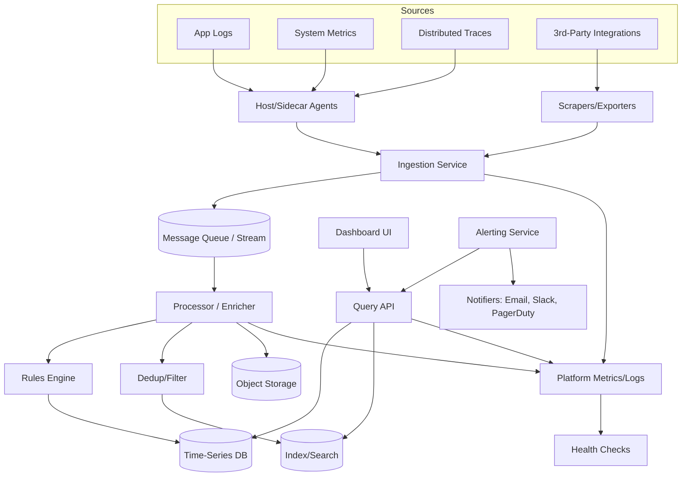

# Monitoring

A modular monitoring and observability system that ingests metrics, logs, and traces from diverse sources, processes and enriches them, stores them efficiently, and provides query/visualization and alerting capabilities.

## Features

- Data ingestion from applications, infrastructure, and third-party sources
- Stream processing and enrichment pipeline
- Scalable storage for time-series, logs, and indexed data
- Query APIs and dashboard UI for visualization
- Alerting with multiple notification channels
- Built-in observability for the platform itself

## Architecture



### Components

- Sources: Applications, infrastructure, and external services emitting logs/metrics/traces.
- Ingestion: Agents/exporters collect data and send it to an ingestion service and stream/queue.
- Processing: Stream processors enrich, deduplicate, and apply routing/rules.
- Storage: Time-series DB for metrics, object storage for raw logs/traces, and index/search for fast queries.
- Access: Query API powering the dashboard UI.
- Alerting: Rules evaluate conditions and send notifications to channels.
- Observability: The platform reports its own health and performance.

## Getting Started

1. Clone the repository:
   ```bash
   git clone https://github.com/Lorieta/Monitoring.git
   cd Monitoring
   ```
2. Configure your data sources and pipeline components (see `config/`).
3. Start the ingestion, processing, and API services.
4. Access the dashboard and create alerts.

## Development

- Use feature branches for changes (e.g., `feat/...`, `fix/...`, `docs/...`).
- Run tests locally before opening a PR.
- Lint and format code according to repository standards.

## Repository Structure

- `cmd/` or `src/`: Service entrypoints and core modules
- `configs/` or `config/`: Configuration files
- `deploy/` or `infra/`: Deployment manifests (Docker/K8s/Terraform)
- `docs/`: Documentation and design notes
- `scripts/`: Utilities for local development

(Adjust to match the actual repository structure.)

## Contributing

- Open an issue for discussion before large changes.
- Submit PRs with clear descriptions, tests, and documentation updates.

## License

Specify the license (e.g., MIT, Apache-2.0) in `LICENSE`.
